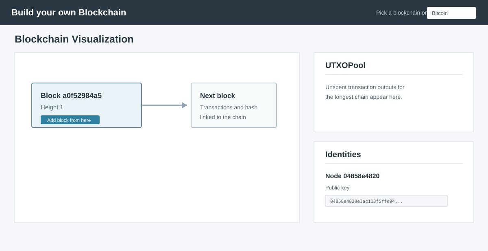
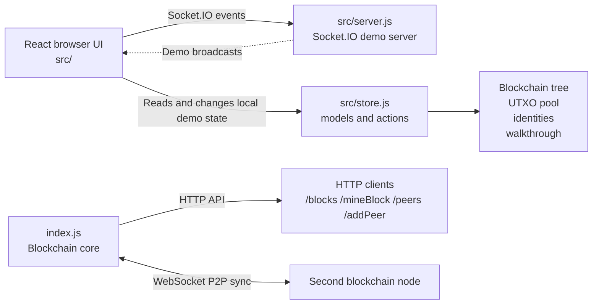

# Node.js Blockchain Core

A lightweight blockchain implementation in Node.js with an interactive React demo for exploring blockchain mechanics. The project demonstrates proof-of-work mining, block validation, peer-to-peer synchronization, and a browser-based walkthrough for learning how blocks and transactions work together.

## Overview

This repository is split into three main pieces:

- `index.js` — the blockchain core that mines blocks, validates chain state, and exposes a small HTTP API
- `src/server.js` — a Socket.IO server used by the browser demo
- `src/` — the React frontend and visualization layer for the blockchain UI

This is intentionally educational and compact rather than production-grade. The chain logic and the UI are separate concerns, which makes it easier to understand the underlying blockchain behavior.

## Features

- SHA-256 proof-of-work mining with configurable difficulty
- Blockchain validation and longest-chain replacement logic
- Peer-to-peer synchronization over WebSockets
- Basic HTTP API for inspecting and extending the chain
- Interactive browser demo with identities, transactions, and walkthrough UI
- Docker support for running the UI and demo server together

## Prerequisites

- Node.js 18+
- npm
- Docker and Docker Compose (optional, for containerized execution)

## Quick start

```bash
git clone https://github.com/PrateekKumar123-glitch/nodejs-blockchain-core.git
cd nodejs-blockchain-core
npm install
```

### 1) Start the Socket.IO demo server

```bash
node src/server.js
```

This listens on port `4000`.

### 2) Start the blockchain node

```bash
npm start
```

This starts the core node on HTTP port `3001` and P2P port `6001`.

### 3) Optional: start a second peer

```bash
npm run peer
```

This starts a second node on HTTP `3002` and P2P `6002`, and connects it to the first peer.

### 4) Start the React client

```bash
npm run client
```

Open the app in your browser:

```text
http://localhost:3000
```

## Demo screenshot

The interface combines a block tree with the current UTXO pool and generated identities:



The preview is stored in [`docs/demo-screenshot.svg`](docs/demo-screenshot.svg) so the README remains self-contained and renders directly on GitHub.

## How to use the UI

1. Choose the default `Bitcoin` chain from the selector, or enter a name and select `Create` to start another local chain.
2. Use the block tree to inspect the current chain. Select `Add block from here` to open the block creation flow.
3. Review the block header, transactions, and signatures before adding the new block.
4. Open the `UTXOPool` tab to inspect unspent outputs for the longest chain. Select an available output to begin broadcasting a transaction.
5. Open the `Identities` tab to inspect the generated public/private key pairs. Use `Add another identity` when the demo needs another participant.
6. Keep the walkthrough enabled for guided explanations, or select `Quit` to explore the interface independently. The walkthrough preference is stored in browser local storage.
7. Open the app in multiple browser tabs to simulate multiple participants in the demo UI.

## Blockchain API

The core node exposes a minimal HTTP API.

| Method | Endpoint | Description |
| --- | --- | --- |
| `GET` | `/blocks` | Returns the current blockchain state |
| `POST` | `/mineBlock` | Mines and appends a new block from the posted `data` payload |
| `GET` | `/peers` | Lists connected peers |
| `POST` | `/addPeer` | Connects to a new peer URL |

### Example: fetch the chain

```bash
curl http://localhost:3001/blocks
```

### Example: mine a block

```bash
curl -X POST http://localhost:3001/mineBlock \
  -H "Content-Type: application/json" \
  -d '{"data":"Demo transaction payload"}'
```

## Architecture



The core node and browser demo are separate runtime layers. `index.js` owns mining, hashing, validation, and peer synchronization. The React app renders its own educational blockchain models, while `src/server.js` relays Socket.IO events between browser participants.

## Docker

You can also run the UI and socket server in containers:

```bash
docker-compose up --build
```

This exposes:

- the frontend at `http://localhost:3000`
- the Socket.IO server at `http://localhost:4000`

## Build the frontend

```bash
npm run build
```

## Repository layout

```text
.
├── index.js                # Blockchain core and P2P network logic
├── src/                    # React app and blockchain demo UI
│   ├── App.js              # Main application shell
│   ├── network.js          # Socket.IO client helper
│   ├── server.js           # Socket.IO server for the demo layer
│   ├── components/         # Blocks, identities, walkthrough, and UI widgets
│   ├── models/             # Blockchain, block, transaction, and UTXO models
│   └── store.js            # UI state and actions
├── public/                 # CRA public assets
├── build/                  # Generated frontend build output
├── package.json            # Scripts and dependencies
├── docker-compose.yml      # Container setup
├── Dockerfile.client       # Client container build
├── Dockerfile.server       # Demo server container build
├── nginx.conf              # Nginx configuration for the client
├── helm-chart/             # Helm chart templates
├── docs/                   # README media and documentation assets
├── README.md               # Project documentation
└── .gitignore              # Git ignore rules
```

## Notes

- This project is intended for learning and experimentation, not for production deployment.
- The blockchain logic is intentionally small and readable so that the core mechanics are easy to follow.
- The browser demo and the network core are separate layers, which is why they are started independently in local development.

## License

MIT
